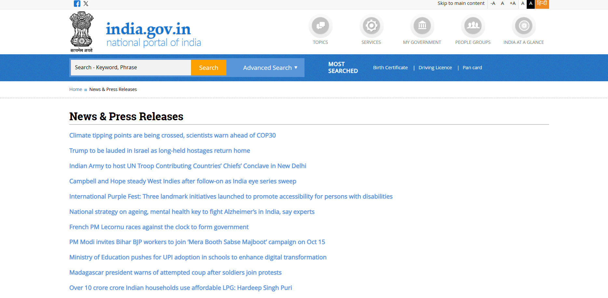
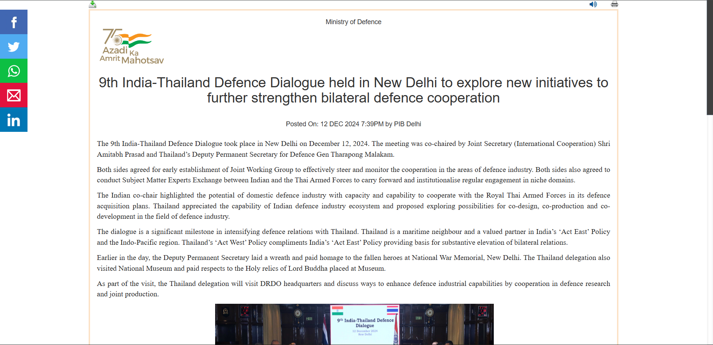
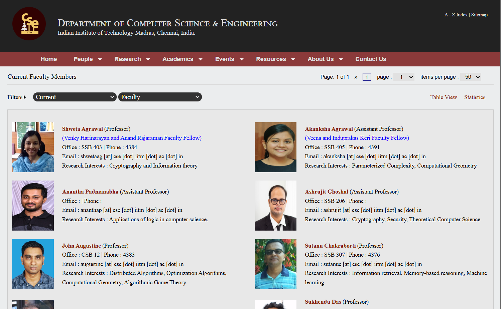
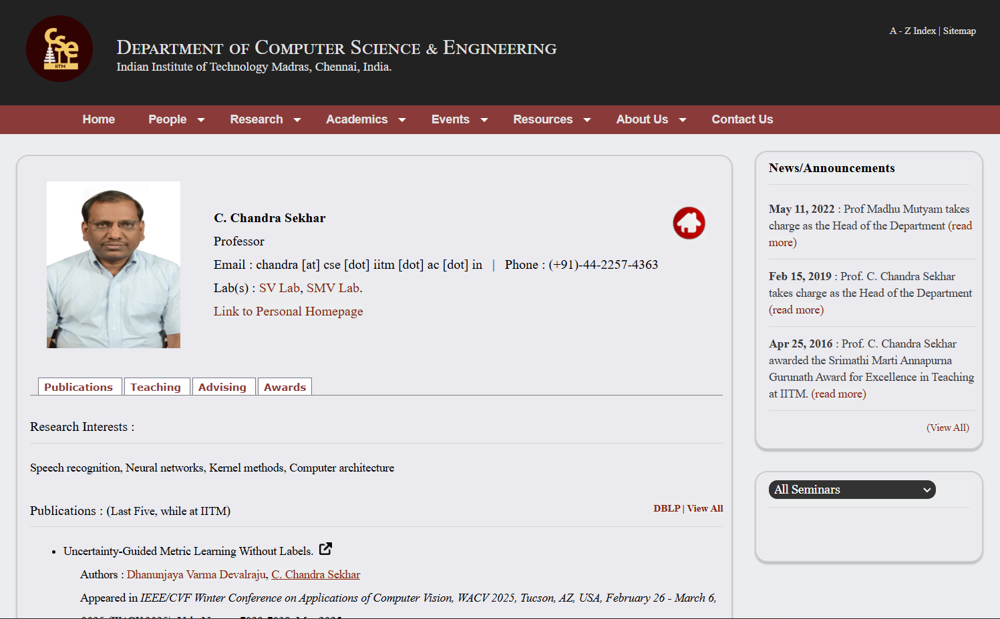
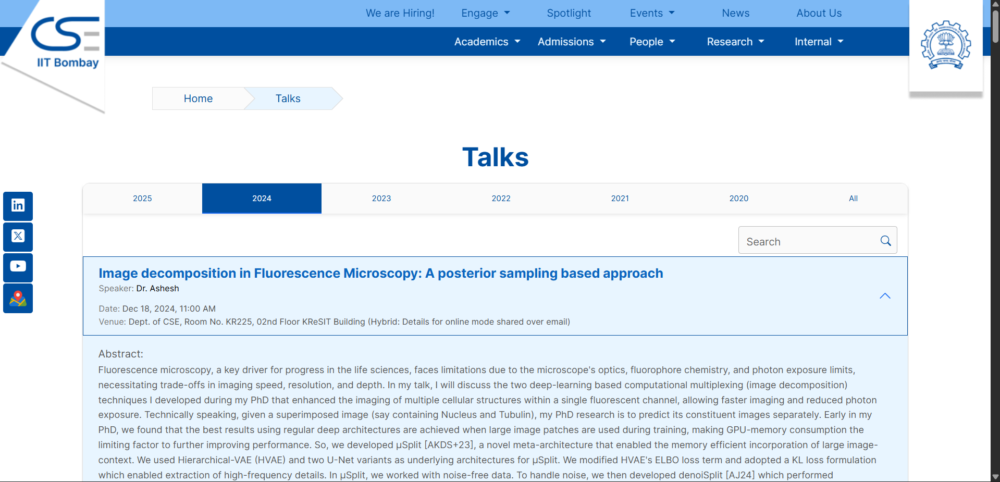
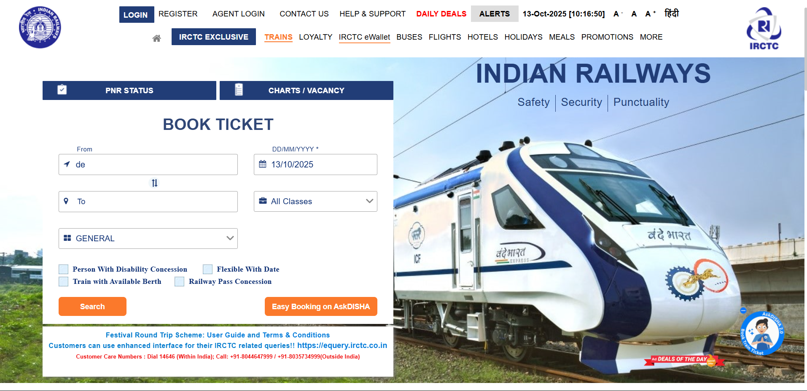

### Site 1: Indian Government Press Releases — https://www.india.gov.in/news_lists
**Issues**
1. Low color contrast between headings and background.
2. Crowded list items — no visual grouping.
3. No clear hierarchy between date/title/source.
4. Too many links in one line → hard to scan.

**Improvements**
1. Use larger font size (16–18px) and stronger contrast (#111 on white).
2. Add spacing (1.5rem) and line-height for readability.
3. Group press releases by month.
4. Highlight the latest release in accent color (#004aad).

📎 Annotated Screenshot:  

### Site 2: One Press Release — https://pib.gov.in/PressReleaseIframePage.aspx?PRID=2083914

**Faculty List Page Issues**:
1.Tabular Layout Limitations:HTML table structure restricts responsive adaptation and modern interaction patterns
2.Poor Image Quality: 60x80 pixel faculty photos are pixelated and provide poor recognition value
3.Information Density:11 columns of data create cognitive overload without clear prioritization
4.No Search/Filter Functionality: Users must scan entire list to find specific faculty members

**Faculty List Improvements**:
1.Card-based layout with 300px minimum width
2.High-quality 150x200px faculty photos
3.Sticky search and filter toolbar
4.Progressive disclosure of information

**Faculty Profile Page Issues**:
1.Unstructured Content:Research interests, publications, and contact info lack clear visual separation
2.Inconsistent Typography:Multiple font sizes and weights without clear hierarchy or rhythm
3.Missing Visual Cues: No section dividers, cards, or background variations to group related content

**Profile Page Improvements**:
1.Two-column layout (photo + basic info | detailed content)
2.Clear section hierarchy with consistent spacing
3.Tabbed interface for publications/courses/contact
4.Visual separation using cards and borders

### 3. IITM CSE Faculty List — https://www.cse.iitm.ac.in/listpeople.php?arg=MSQw

**Issues**
The list is dense, with minimal row spacing, making scanning hard.
No visual differentiation between header row and data rows.
Names and roles are tightly grouped; no separation or column alignment cues.
The table is full width, maybe squeezing on mobile.
No hover or highlight effect to show which row you might select or click.

**Improvements**
Increase row padding & line height to improve readability.
Use a sticky or bold header row with background to separate header from data.
Align columns (Name, Role, Contact) clearly, perhaps with grid or table borders/subtle lines.
Use responsive breakpoints or horizontal scroll on mobile rather than cramming.
Add hover highlight (background color) or focus-visible for row links.

### 4. IITM Faculty Profile — https://www.cse.iitm.ac.in/profile.php?arg=Nw==

**Issues**
The profile image may be small or not well balanced with text.
The role / designation and name lack visual hierarchy (they look similar).
Contact links or additional info are often buried or not clearly separated.
Sections (publications, biography) are not well sectioned and may flow together.
Sidebars or menus, if present, may be too subtle or not sticky.

**Improvements**
Increase image size or place it prominently next to name/bio.
Use a larger font or different weight/color for the name, a secondary style for designation.
Separate contact, email, external links in a dedicated block or sidebar.
Use section headings (e.g. “Research Interests”, “Publications”) with spacing and underline or divider.
Make sidebar or navigation sticky so that users can jump to subsections easily.

### 5. IITB Talks (sample) — https://www.cse.iitb.ac.in/talks?year=2024&id=1779

**Issues**
The talk title and speaker info may blend with body text; low contrast or differentiation.
There may be long paragraphs with no breaks, making it dense.
Side navigation or related links may not be obvious or visually prominent.
Images or video, if present, may not be responsive or with appropriate aspect ratio.
The metadata (date, venue) may not be well positioned or distinct from content.

**Improvements**
Style the title distinctly (bigger size, bold) and separate from the content.
Break content into shorter paragraphs or subheadings.
Include a side or top nav or “Other Talks” link block with visual cues.
Use responsive containers or constraints for images/videos (max-width, aspect ratio).
Place metadata just below the title, with subtle styling (muted color, italics).

### 6. IRCTC Train Search — https://www.irctc.co.in/nget/train-search

**Issues**
The search form is busy, with many input fields and buttons; cognitive load is high.
Buttons, dropdowns, and inputs may lack consistent spacing or alignment.
Error or empty states (e.g. “no trains found”) might not show helpful message.
The page color palette and contrast may not meet accessibility (some disabled controls too faint).
On mobile, the form may not be well optimized (fields too small, wrapping awkwardly).

**Improvements**
Group related form fields visually (departure, arrival, date) with spacing and alignment.
Use consistent margins/paddings between inputs and buttons, and align labels.
Provide clear feedback if no results (e.g. “No trains available for this route/date”) with friendly advice.
Ensure disabled inputs, error states, and active states have sufficient contrast.
For mobile, stack form fields vertically, use larger touch targets, perhaps a collapsible filter section.

