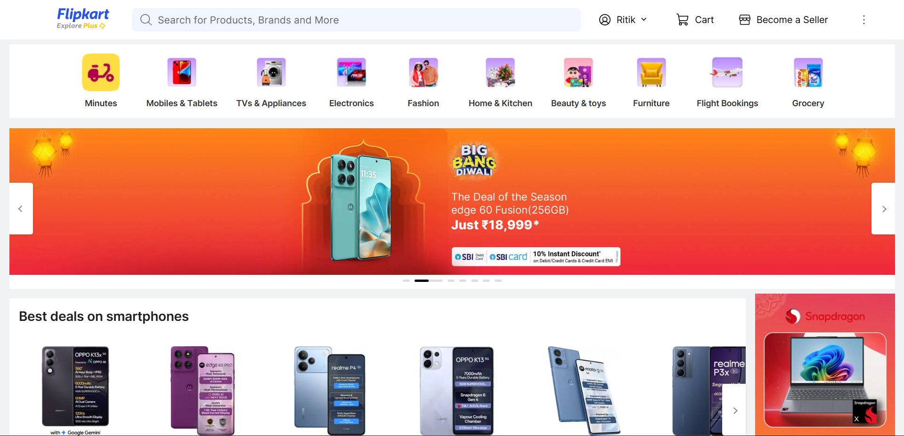
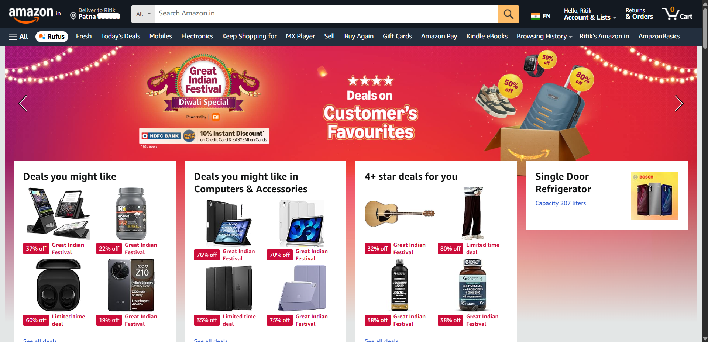
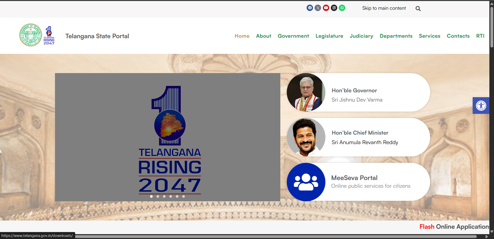

### Comparison 1 — Flipkart vs Amazon (Mobiles Listing)
**Flipkart**
- Denser grid, smaller images.
- Filter panel clear but cramped.
- Rating visibility low.

**Amazon**
- Better use of whitespace.
- Strong visual hierarchy (title → rating → price).
- Sticky filters on scroll.

**Key Takeaway:**  
Amazon balances density and scannability better. Flipkart could benefit from padding and font-size adjustments.

📎 Annotated Screenshot:  

flipkart:

amazon:

## Comparison — Telangana vs Michigan State Portal

**Telangana Portal**
- Issues:
  1. Crowded layout with weak hierarchy.
  2. Unclear top navigation.
  3. Poor contrast and uneven spacing.
- Improvements:
  - Group navigation logically.
  - Simplify hero banner.
  - Improve color contrast and spacing.

**Michigan State Portal**
- Issues:
  1. Minimal contrast in nav and hero.
  2. Inconsistent visual hierarchy.
  3. Weak keyboard focus visibility.
- Improvements:
  - Highlight active nav.
  - Add hero value content.
  - Standardize icons and improve a11y.

**Annotated Screenshots:**
Telengana

michigan

